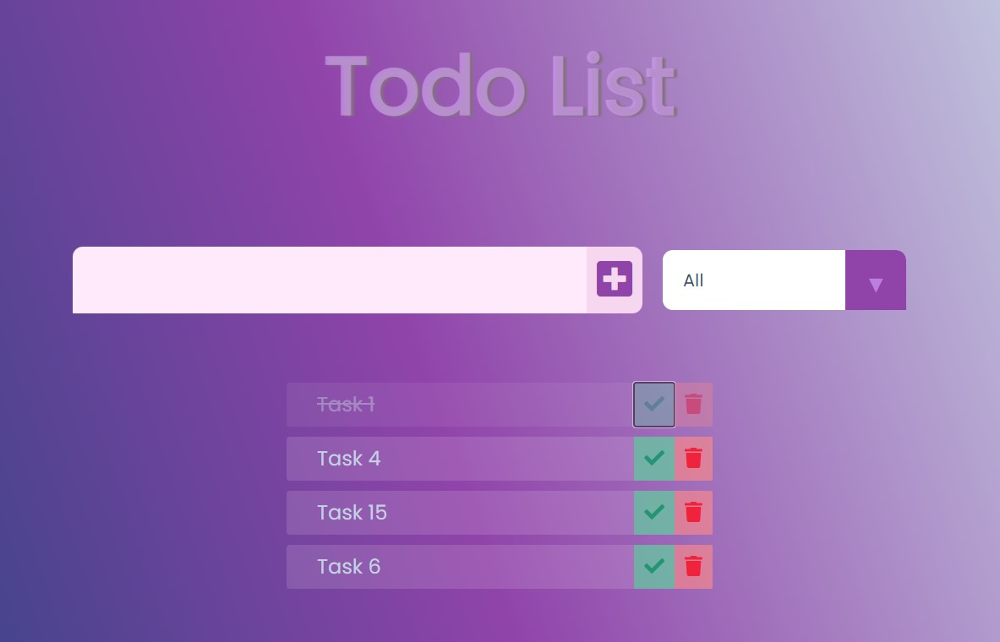

## Welcome! 👋

### Screenshot
Github IO- [Test it](https://na-r-84.github.io/Todo-List/)

The users should be able to:

-Create a Todo list
-Delete it
-complete it
-sort it by the complited or uncomplited list 

## My process

### Built with

- Semantic HTML5 markup
- CSS custom properties
-Java script

## Author

- Website - [Nasim Roshan](https://portfolion.nasiiimdev.se/)
